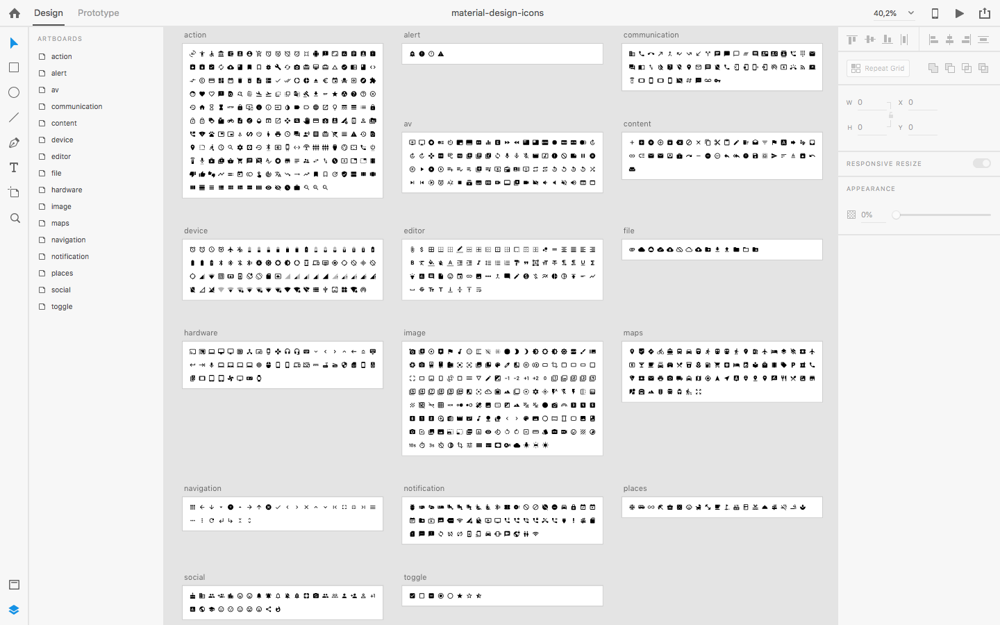

# Material Design Icons for Adobe XD

Adobe XD file contains 24 pixel [Material Design Icons](https://material.io/tools/icons/?style=baseline) symbols. Based on [material-design-icons v3.0.1](https://github.com/google/material-design-icons) svg files.

## Screenshots

